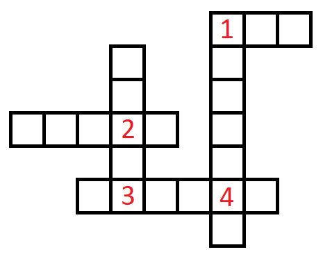
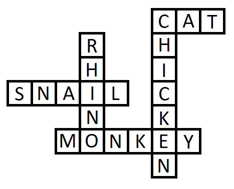

# Fill-in solver

Program solves fill-in puzzle given on an input.

## Usage example

### Fill-in puzzle

Here is the fill-in puzzle example. The crossing blanks are marked with numbers and they are used for representing the blanks in input and output files.



### Input files

#### Words input file

```
rhino
cat
chicken
snail
monkey
```

#### Blanks input file

```
1 . .
. . . 2 .
. 3 . . 4 .
. . 2 . 3
1 . . . . 4 .
```

### Output file

```
1 . . [cat]
. . . 2 . [snail]
. 3 . . 4 . [monkey]
. . 2 . 3 [rhino]
1 . . . . 4 . [chicken]
```

### Solved fill-in puzzle


